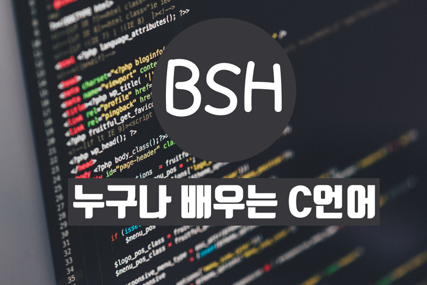

 
#C 언어를 배워야 하는 이유는? 

C언어를 배워야하는 첫번째 이유는 다른언어들을 훨씬 쉽게 습득할수 
있다는 것 입니다. C++ C# 등의 언어들도 C 언어에서 많은 영향을 받았습니다. 
이렇게 C언어부터 배워가면 다른 영향을 받은 언어들도 쉽게 배우실수 있습니다. 
두번째 이유는 엄청나게 많은 코드들이 C 언어로 작성되어 있습니다. 
만약 다른언어들을 배워서 어느정도 수준에 도달했을때, C 언어를 피하실수는 
없을 것 입니다. 

#C 언어를 배우는데 필요한 준비물은? 

1. 노력
1. 컴파일러
1. 머리
C 언어를 배우려면 위와같은 것들이 필요합니다.
그런데 컴파일러가 무엇일까요?
다음강좌에서는 컴파일러에 대해서 배워보겠습니다.
